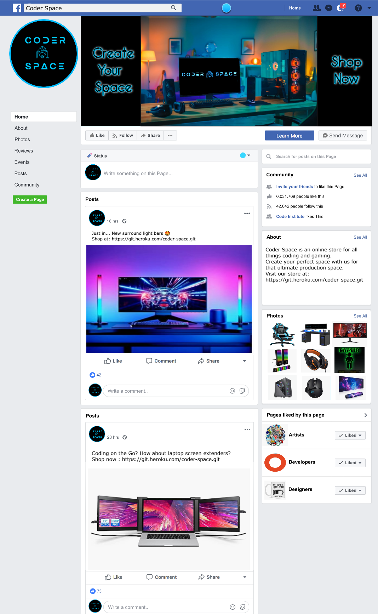
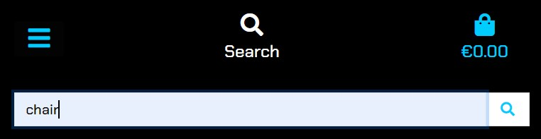
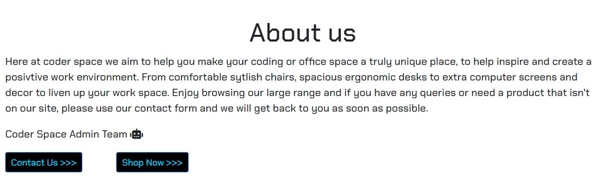
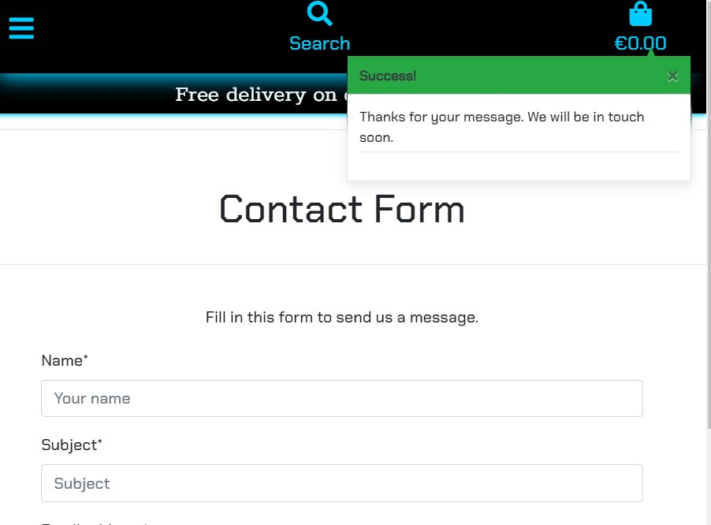
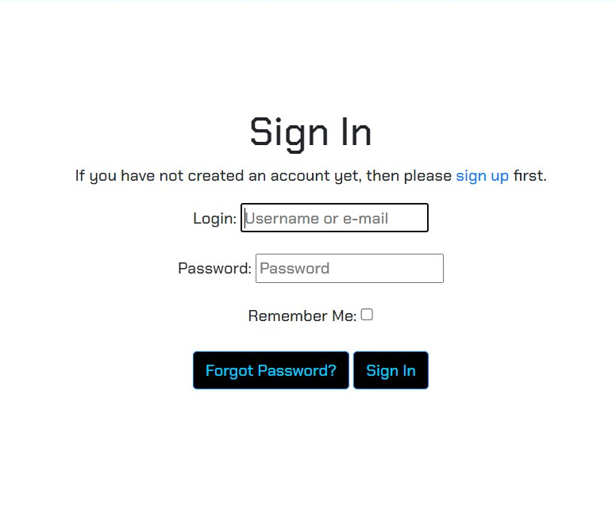
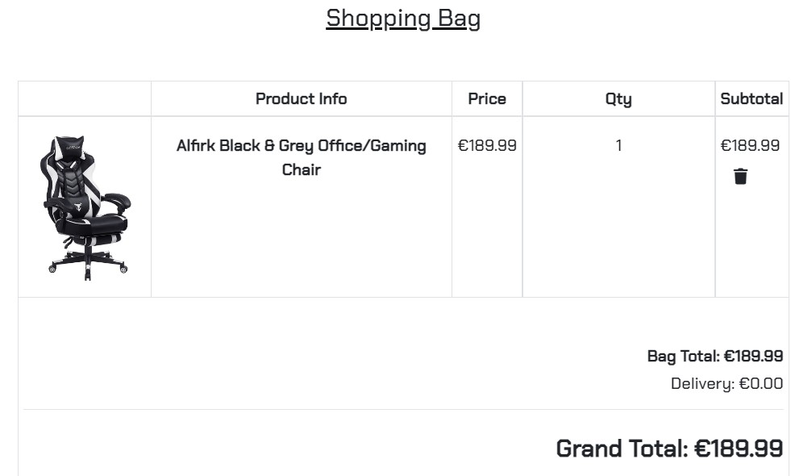
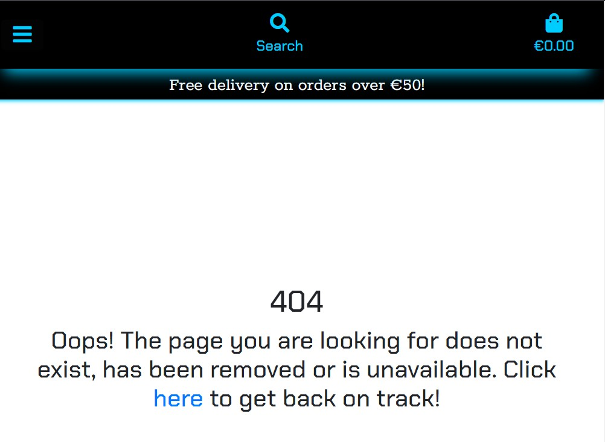

# Coder Space

## View the live site [here](https://coder-space.herokuapp.com)

## Table of contents:
- ##  [UX Design](#Manual-testing)
    - [Agile Planning](#Agile-Planning)
    - [Project Goal](#Project-goal)
    - [Target Audience](#Target-audience)
    - [Business Goals](#Business-goals)
    - [Customer Goals](#customer-goals)
    - [User Stories](#User-stories)
    - [Seo and web marketing](#Seo-and-web-marketing)
    - [Scope](#Scope)
    - [Structure](#Structure)
    - [Database](#Database)
    - [Models](#Models)
    - [Wireframes](#Wireframes)
    - [Design](#Design)
    - [Colors](#Colors)
    - [Typography](#Typography)
    - [Images](#Images)
    
- ##  [Features](#Features)
    - [Navbar](#Navbar)
    - [Footer](#Footer)
    - [Home](#Home)
    - [Products](#Products)
    - [Add products](#Add-products)
    - [Profile](#Profile)
    - [Register](#Register)
    - [Login](#Login)
    - [Logout](#Logout)
    - [Shopping bag](#Shopping-bag)
    - [Checkout](#Checkout)
    - [Error pages](#Error-pages)
    - [Future Features](#Future-features)

- ##  [Languages and Technologies](#Languages-and-Technologies)
    - [Languages](#Languages)
    - [Frameworks](#Frameworks)
    - [Database](#Database)
    - [Other Technologies](#Other-Technologies)
    - [Testing](#Testing)

- ##  [Deployment](#Deployment) 
    - [Heroku](#Heroku)
    - [Forking](#Forking)
    - [Cloning](#Cloning)    

- ##  [Credits](#Credits) 

# UX Design
---
## Agile Planning

User stories (Issues) with acceptance criteria and tasks are each linked to an Epic (Milestone) and placed in an Iteration kanban board (Projects 1, 2 and 3). Each user story in the kanban board is labelled with a "must-have", "should-have", or "could-have" label of different colours to show their prioritisation for the project. See the table of User Stories [here](#user-stories).

## Project Goal

The goal of the project is to create an online store that sells a custom office/gaming/office space products all in one place. As the work place has changed since Covid and hybrid working is now a reality, more and more people are working at a desk space at home. The main goal was to showcase a range of products to help make a more productive work environment. A creative space that the customer can truly enjoy whilst working or creating and developing. Coder space was created for coders, software developers and software engineers at the forefront of the initial design phase. During development it became apparent that the store is for anyone looking to customize or upgrade their work space at home.

## Target audience

- People who work from home 
- People who like to play console and or online games
- People who want a stylish functional creative space to work, game or develope software
- People looking for unique office style products but with a custom feel.

## Business Goals

- To create a professional online store
- To provide an easy and secure means to purchase items.
- To increase an one stop shop for creating your personal work space
- To create a brand for the store and increase brand awareness

## Customer Goals

- To view the products available
- To buy functional office like products but with a customized feel.
- To navigate easily through the website
- To be able to pay securely for items
- To be confident that the site is genuine and trustworthy

---
# User Stories

Using the Agile approach Epics (Github Milestones) were created and broken down into User Stories (Github Issues). User Stories were planned out with Acceptance Criteria and Tasks assigned to each. Acceptance criteria was used in measuring testing outcomes (see [TESTING.md](https://github.com/Charte-dot/Coder-Space/blob/main/TESTING.md) ).

User Stories were sorted into Three priority levels with 1 as top priority and 3 as least prioritised. User Stories with Priority 1 were allocated a label of 1 as 'must-have', 2 as 'should-have', 3 as 'could-have'. These User Stories were divided into three Iterations (Github Projects). Some user stories have been allocated a label of 'could-have' and feature on the kanban board in iteration 3. These user stories are in the to-do column and can be previewed in the [Future Features](#future-features) section of the READ.me. User stories in the kanban board which were not implemented are marked "F" for Future Feature in the table below. One of the issues has a 'B' in the priority column this is due to on going bug. More information regarding this in [TESTING.md](https://github.com/Charte-dot/Coder-Space/blob/main/TESTING.md).

| User Story ID | As A/An | I want to be able to | So that I can | | # | Priority | Iteration |
|---------------|--------------------|----------------------------------------------------------------------------|---------------------------------------------------------------------------------------------------------------|---|-----|----------|----------:|
| EPIC | Enable users to view and navigate the site | | | | | |
| 1 | | | | | | | |
| 1.1 | Shopper | View a list of products | Select some to purchase | |[#1](https://github.com/Charte-dot/Coder-Space/issues/1)| 1 | 1 |
| 1.2 | Shopper | View Individual Products  | See the price and product description | |[#2](https://github.com/Charte-dot/Coder-Space/issues/2)| 1 | 1 |
| 1.3 | Shopper |identify each category or product available  | find the exact product I need | |[#3](https://github.com/Charte-dot/Coder-Space/issues/3)| 1 | 1 |
| 1.4 | Shopper |Easily identify the total cost of my purchases at all times | Keep track of total cost. | |[#4](https://github.com/Charte-dot/Coder-Space/issues/4)| 1 | 2 |
| 1.5 | Shopper | I want to be able to view more information about the store  | increase my confidence that the store is genuine, trustworthy and reliable to purchase from | |[#5](https://github.com/Charte-dot/Coder-Space/issues/5)| 1 | 3 |
| 1.6 | Shopper | View a review on products |  decide if a product will suit my needs | |[#6](https://github.com/Charte-dot/Coder-Space/issues/6)| 1 | 2 |
| 1.7 | Shopper | I can View a social media page for more info on products | any offers or extra content from the store | |[#7](https://github.com/Charte-dot/Coder-Space/issues/7)| 1 | 1 |
| 1.8 | Shopper |I can View the average ratings on a product | get an idea of the quality of a product at a glance| |[#8](https://github.com/Charte-dot/Coder-Space/issues/8)| F | 2 |
| 1.9 | Shopper |I can View a list of FAQ's,  | easily find answers about the site | |[#9](https://github.com/Charte-dot/Coder-Space/issues/9)| F | 3 |
| 1.10 | Shopper |I can create a wish list, | come back at a late date to purchase | |[#10](https://github.com/Charte-dot/Coder-Space/issues/10)| F | 3 |
| EPIC | | Enable user Sorting and searching functionality | | | | | |
| 2 | | Sorting and searching | | | | | |
| 2.1 | Shopper |Sort the list of available products available, | easily find the product I am looking for.| |[#16](https://github.com/Charte-dot/Coder-Space/issues/16)| F | 3 |
| 2.2 | Shopper |I want to be able to easily see what I have searched for and the number of results| quickly see how many products are available.| |[#17](https://github.com/Charte-dot/Coder-Space/issues/17)| 1 | 2 |
| EPIC | Enable users to Register and manage own account | | | | | |
| 3 | |  | | | | | |
| 3.1 | Shopper |I can register for an account |  have a personal account to be able to save details and view previous orders| |[#11](https://github.com/Charte-dot/Coder-Space/issues/11)| 1 | 1 |
| 3.2 | Shopper |I can Easily login and logout of my account| access my own account on the site| |[#12](https://github.com/Charte-dot/Coder-Space/issues/12)| 1 | 1 |
| 3.3 | Shopper | I can recover my password hassle free should I forget it | gain access to my account.| |[#13](https://github.com/Charte-dot/Coder-Space/issues/13)| 1 | 1 |
| 3.4 | Shopper |Have a confirmation email to advise that registration has been successful | Have acknowledgement that my registration details were accepted and saved.| |[#14](https://github.com/Charte-dot/Coder-Space/issues/14)| 1 | 1 |
| 3.5 | Shopper |I can have a personal profile, | View my personal details for delivery and payment and update as needed | |[#15](https://github.com/Charte-dot/Coder-Space/issues/15)| 1 | 1 |
| EPIC | Enable users a safe and secure checkout | | | | | |
| 4 | | | | | | | |
| 4.1 | Shopper | select the quantity of a product that I am purchasing | visually see the correct quantity and modify if needed.| |[#18](https://github.com/Charte-dot/Coder-Space/issues/18)| 1 | 2 |
| 4.2 | Shopper |View items as they are placed in my basket | keep account of the total cost of the purchase| |[#19](https://github.com/Charte-dot/Coder-Space/issues/19)| 1 | 2 |
| 4.3 | Shopper | modify the quantity of each item in my basket | make changes to my purchase before I checkout| |[#20](https://github.com/Charte-dot/Coder-Space/issues/20)| 1 | 2 |
| 4.4 | Shopper | enter my payment details hassle free | checkout my purchases quickly and easily.| |[#21](https://github.com/Charte-dot/Coder-Space/issues/21)| 1 | 2 |
| 4.5 | Shopper |  Give my personal payment details and information and know its secure and safe | Be confident to be able to provide the necessary information to make a purchase.| |[#22](https://github.com/Charte-dot/Coder-Space/issues/22)| 1 | 3 |
| 4.6 | Shopper |  receive an order confirmation after order has been placed |  have an written record of my purchases| |[#23](https://github.com/Charte-dot/Coder-Space/issues/23)| 1 | 2 |
| 4.7 | Shopper | receive an confirmation email after order has been placed | have an written record of my purchases.| |[#31](https://github.com/Charte-dot/Coder-Space/issues/31)| B | 3 |
| EPIC | Set up admin to manage site | | | | | |
| 5 | | | | | | | |
| 5.1 | Site Owner | a product that I am purchasing | add new items to the site when needed.| |[#24](https://github.com/Charte-dot/Coder-Space/issues/24)| 1 | 2 |
| 5.2 | Site Owner | can select the quantity of a product that I am purchasing | change information on a product as needed.| |[#25](https://github.com/Charte-dot/Coder-Space/issues/25)| 1 | 3 |
| 5.3 | Site Owner | delete products |  remove Items no longer for sale.| |[#26](https://github.com/Charte-dot/Coder-Space/issues/26)| 1 | 3 |
| EPIC | Enable Users to interact with the site  | | | | | | |
| 6 | |  | | | | | |
| 6.1 | Shopper | rate a Product | give feedback to other shoppers.| |[#27](https://github.com/Charte-dot/Coder-Space/issues/27)| 3 | 3 |
| 6.2 | Shopper | review Products | give a good view to other shoppers of the product.| |[#28](https://github.com/Charte-dot/Coder-Space/issues/28)| 1 | 3 |
| 6.3 | Shopper | contact the store with any product or purchase queries | resolve any product or purchase issues I may have.| |[#29](https://github.com/Charte-dot/Coder-Space/issues/29)| 1 | 3 |
| 6.4 | Shopper | sign up to a newsletter | keep up to date with new products that become available.| |[#30](https://github.com/Charte-dot/Coder-Space/issues/30)| 1 | 3 |
---

# SEO and Web Marketing

- SEO 

Research on short and long-tail keywords was conducted via google searches to find the search words and phrases that most related to a site like Coder Space. "Personalized" was found to be particularly useful to a good search result when incorporated with the product categories ("Chairs", "Desks", "lights"). Keywords were incorporated into the meta tags and headings where appropriate while not overloading the site content and maintaining the usefulness of the site.

- Web Marketing

Paid web advertising is not currently within the scope of this project. However a newsletter link has been added to the website as an easy way for a small business such as Coder Space to reach customers and keep them up to date with new products, special offers and to keep the ecommerce store fresh.

- Facebook Business Page

As part of the scope of this project, social media marketing was a key element. Due to a change in Facebook's policy, creating a fake business page is against community standards. In place of a live facebook business page, a mock up of what the Facebook business page would have appeared to customers. 

- Privacy Policy

A privacy policy is a legal requirement because of GDPR legislation. This also benefits the website as it looks professional and more importantly inspires trust in the website user. A link to the privacy policy page is included in the footer.

---
# Scope

- Requirements

The approach taken was to create a minimum viable product to create a functioning ecommerce store with the ability to view and purchase a product via a seamless payment facility (in this case Stripe).

The User Stories were prioritised as described [above](#user-stories) and shown in the table with functional requirements prioritised as 1

## Structure

The website consists of thirteen pages:
- Home page with shop now button.
- Products page were the user can view all products available.
- Product details page where the user can view individual products in greater detail.
- A profile page that registered users can view their previous orders.
- An accounts page for registering, loging in and loging out.
- Products management page for admin to create, update, edit and delete products.
- A contact page for users to contact store owners.
- An about page to give more information about the store.
- A newletter subscription and unsubscription page.
- A review page for users to leave reviews on products.
- A shopping bag page that users can view products they placed in their bag.
- A checkout page with functional payment section.
- Confirmation of order page which saves in users profile if logged in.

## Database

For this project the PostgreSql database ElephantSQL was used from mid-point in the project due to changes with Heroku. A fixtures file was used for this project due to the amount of products within the project. I used the fixtures file provide the Boutique Ado walkthrough as a template and modified the files with [json file editor](https://jsonformatter.org/json-editor) to add and create my own fixtures file for categories and products.

## Models

As required by the project brief, three custom models were to be created and include within the project along side the other models that create the site.
The three custom models created and implemented for the purpose of this ecommerce store: Reviews, Newsletter subscription and a Contact form.

- Reviews Model:
A simple review model that allows uses to leave a review on products through the products details page.
Admin can delete the reviews from the admin panel. A possible future feature of reviews appearing with in admin profile on the site for easy monitoring. 

- Contact Model:
A contact model that complements the implementation of a contact form for Users to contact the ecommerce with any queries or complaints. Admin can view any messages from the contact form with in the admin panel.

- Newsletter subscription model:
A simple newsletter subscription model that allows the user to subscribe to an online newsletter from Coder Space. A link within the the subscription page also allows the user to unsubscribe. Admin can view subcribers to the newsletter form the admin panel and an email is auto sent to the subcriber advising of the newsletter subscription.

---

## Wireframes

Wireframe created to help assist the design element and keep the project within the original design idea.
Some elements have been changed for a more appealing design on the final project.

- Home Page

- Products Page

- Product Details Page

- Add to bag Page

- Bag Page

- Checkout Page

- Sign-in Page

- Register Page

- Profile Page

- Contact Page

---

## Design 

### Overall design of site

- The emphasis is to look professional and modern and to showcase the high quality products for sale. Research on websites selling similar products, seemed very clutter and over loaded with information, products and color. From this I decided that a netural color scheme with a pop of color within the navigation of the site would help prevent that cluttered over loaded experience, whilst providing individual card for each product with enough space between the images. Clear labeled product names situated at the top of the image and price and rating below the image. As the product images are a range of colors, a netural color scheme was chosen for the background where the images would be displayed. The navigation, buttons, links, footer and dropdown menu where all kept the same color to help the user intuitively navigate the site with ease.

### Colors

The colors for the site was choosen from the home page image. Having a majority of white in the site made it very cold and clinical, I decided that the netural color would be black, bold enough to make a statement but a netural color to not over power the product images. I choose a sky blue (from the home image) to clash against the black to provide that bright color contrast. This is the only bright colour used in the color scheme as the products images are colorful enough without overloading the visuals on the site.   

---

### Typography

- [Chakra petch](https://fonts.google.com/specimen/Chakra+Petch?query=Chakra+Petch) was used for all text throughout the site. This font gives a digital, commanding vibe but is easy to read whilst being stylish. It looks bold but contrasts well with the blue and black colored texts.

---

### Images
As it is an ecommerce site, sourcing original products and images for that type of store selling product to create your own home office area was a large task. All product images were sourced from [Amazon Uk](https://www.amazon.co.uk/) and [barcode look up ](https://www.barcodelookup.com/) was used for the images on the site (recommendation from slack) and [Adobe express](https://www.adobe.com/express/) was used to modify some of the image to show the coder space logo.

---
# Features

## Navbar

- Logo: The logo is Coder Space name separate by a robot style icon, chosen to be instantly recognisable to site users. The logo links to the home page and is positioned on the left as this is where the user expects it to be. Logo was created using
[Adobe express](https://www.adobe.com/express/)

- Page links: On large screens the nav links are centered directly under the search bar. On smaller screens the nav links are compressed into a drop down menu.

- Search Box - On large screens a search box appears the center of the  top menu. Users can enter a single word to search within the title or description of a product. Users can click enter or the magnifying glass icon to enter the search. The products list is then filtered by the search term and resulting products are displayed with the number of results displayed above. If no products are found '0 products found' is displayed. On smaller screens the search box is contained within an icon and dropsdown when clicked for user to search.

- Shopping Basket: On large screens the shopping basket appears on the right of the search bar. The basket is coloured blue in keeping with the brand color and to make it stand out in the menu. When clicked the icon opens up the current basket page. Below the basket is an indicator of the total cost of the items currently in the basket, also coloured blue to match the basket. On smaller screens the basket icon is positioned on the far right of the screen.

- When the navigation page menu links are hovered over their colours are inverted to blue background and white font colour.

---
## Footer
- The footer is divided into three sections: Quick Links to the about page, contact page & privacy policy. A newsletter subscribe button.  A section with the social media icon links.

- About Page: Located within quick likns in the footer, is an infomative page about the store. With two CTA buttons one for contacting the store and the other to shop.

- Contact Us: The contact page is located within the quick links sectiion in the footer. A mean for the user to contact the store with any queries. A simple form with user feed back after submitting their query.

- Privacy policy: This is located in the quick links within the footer. When user click on the privacy link, the page opens on a seperate page with all the details regarding the privacy for Coder Space. The full privacy policy can be found [here](https://www.privacypolicygenerator.info/live.php?token=WGMqQK9vmPgIx2LPPPY4Bmg9gHJl9FGJ)

- Newsletter subscription: Located central within the footer with a CTA button for user to subscribe to a newsletter. The Subcription form is on a seperate page with only an email field to be filled out. The link to unsubscribe is also with the subscription page.

---

## Home Page
- The home page is a simple page, with a CTA button to shop now which opens the all products page. The main image give the user an idea of the what the store is before entering the products or shop now button.

---
## All products page
- This page displays all products available on the store. 

- Can be accesed by the shop now button on the home page or all products link on the nav bar.

- On smaller screens the all products link can be found in the dropdown menu or home link in the footer.

- Each product image in the product list links to its product detail page

- Edit/delete buttons are visible to superuser/administrator under the product price but not to a non-admin user

---

## Product detail page.

- Each product detail page features a large image of the product.

- Large product name top right above the description.

- On the right side of the page is the price, product description, quantity selector, product reviews, keep shopping button and an add to bag button. 

- Edit/ delete button are only viewable to superusers/admin, located beside the rating.

- A quantity selector box with + - selector to increase/decrease quantity of item. Users can also enter a whole number or use arrows inside box to increase/decrease the quantity of the item

- Two CTA buttons - one to return to the main Shop page and one to add the item(s) to shopping basket

---

## Add products page

- The Add Product page can only be accessed by the administrator/superuser and is only visible in the navbar Profile dropdown menu if the user is logged in as administrator or superuser.

- This page features a form for the administrator/superuser to add a product with fields from the product model: Category, product name, description and price.

- The form to edit a product can be accessed only by the administrator from the products or product detail page. This is the same form as to add a product with the fields auto completed which can be changed by the administrator.

---

## Profile
- The link to this page can only be seen if a user is logged in.

- On the left the delivery information is displayed if the user has selected save my info during checkout process.

- The user can change the default information by entering information into the fields

- An update information button is below the delivery information form which can be clicked to submit and save changed information

- On the right the user's order history is displayed in a table with order number, date of order, items ordered and the order total. The Order number is truncated but on hover the full number can be viewed. On click the full past order confirmation is displayed.

---

## Register

- Features a form with input boxes for email and email confirmation, username, password and password confirmation

## Login

- Features a form with input boxes for required fields username and password

## Log out

- Features a button to click at the bottom of the form to sign out 

---

## Shopping bag

- Features summary information of products added to the shopping basket: image of products, title, size, price, delivery cost and total

---

## Checkout

- The Checkout page features input boxes for the necessary payment information inputs: name, email, phone number, street address, town or city, country, post code, country

- At the bottom is the box for card payment information for Stripe. For testing purposes the number 4242 4242 4242 4242 is used

- Two selectors are at the bottom to return to adjust the basket or complete order buttons to complete the payment process

- After checking out a success message and order confirmation are displayed

---

## Error pages

- 404: A 404 page was created to handle users' navigational errors and to direct them back to the website. The navigation menu and logo are visible on the page

- 500: A 500 server error page was created to handle internal server errors

---

## Future Features

- FAQ'S section for questions the users might have in relation to products, delivery and refunds.

- Rating system that allows users to rate products on the review form.

- Reviews from user link to a admin profile and reviews can be deleted from the admin profile.

- A wishlist function that allows users to mark a product and it then appears in their profile under a wishlist section.

---

# Languages and Technologies

## Languages

* [HTML5](https://en.wikipedia.org/wiki/HTML5) was used to build the front-end website
* [CSS](https://en.wikipedia.org/wiki/CSS) was used to style the HTML and add responsiveness
* [JavaScript](https://www.javascript.com/) (no custom JS) was used with Bootstrap to provide interaction on the front-end
* [Bootstrap 4.6](https://getbootstrap.com/docs/4.6/getting-started/introduction/) was used to style the website, add responsiveness and interactivity
* [Python](https://www.python.org/) was used to code the back end of the project
* [PyPI](https://pypi.org/) to install the python packages
* [boto3](https://boto3.amazonaws.com/v1/documentation/api/latest/index.html) was used to connect the project to AWS

### Frameworks

* [Django 3.2.8](https://docs.djangoproject.com/en/3.2/)
* Django supporting libraries:
  - [allauth](https://django-allauth.readthedocs.io/en/latest/installation.html) for authentication, registration, account management as well as 3rd party (social) account authentication
  - [crispy-forms](https://django-crispy-forms.readthedocs.io/) to style the forms
  - [gunicorn](https://gunicorn.org/) as the server for Heroku
  - [psycopg2](https://pypi.org/project/psycopg2/) as an adaptor for Python and PostgreSQL databases
  - [dj-database](https://pypi.org/project/dj-database-url/) to parse the database URL from the environment variables in Heroku
  - [django-storages](https://django-storages.readthedocs.io/en/latest/) was used for backend storage with AWS
  - [django-countries](https://pypi.org/project/django-countries/) was used to provide a country field for the Order model
  - [Pillow](https://pillow.readthedocs.io/en/stable/) was used to manage images for Python

## Database

* [Elephant Postgres](https://www.elephantsql.com/) was used for the database in production and development

## Other Technologies
* [Amazon Web Services](https://aws.amazon.com/) was used to host the static files and media
* [Gitpod](https://github.com//) was used as the IDE
* [Git](https://git-scm.com/) was used for version control via the terminal in Gitpod
* [GitHub](https://github.com/) was used to store the code in the repository
* [Heroku](https://www.heroku.com/) was used as the cloud based platform for deployment
* [Stripe](https://stripe.com/en-ie) was used to handle payment transactions
* [Fontawesome](https://fontawesome.com/) was used for icons
* [Google Fonts](https://fonts.google.com/) was used for the fonts
* [Balsamiq](https://balsamiq.com/) was used for the wireframes
* [Google Chrome Dev Tools](https://developer.chrome.com/docs/devtools/) was used to inspect the website during development to check reponsiveness, contrast and JS errors in the console
* [Favicon.io](https://favicon.io/favicon-converter/) was used to generate the favicon
* [Am I responsive](https://ui.dev/amiresponsive) was used for the site mockups
* [Google Chrome](https://www.google.com/intl/en_ie/chrome/) was used for previewing the project in the browser
* [Google Sheets](https://www.google.com/sheets/about/) was used for the database schema tables
* [Adobe Express](https://www.adobe.com/express/create) was used for the Coder Space logo and photo editing.
* [W3C Markup Validation Service](https://validator.w3.org/) was used to validate the HTML
* [W3C CSS Validation Service(Jigsaw)](https://jigsaw.w3.org/css-validator/) was used to validate the CSS
* [PEP8 from Code Institute](https://pep8ci.herokuapp.com/) was used to validate the Python code
* [JSHint](https://jshint.com/) was used to check for errors in Javascript
* [Coolors](https://coolors.co) was used to generate the colour palettes
* [TinyPNG](https://tinypng.com/) was used to resize images for the website
* [Barcode Look up](https://www.barcodelookup.com/) was used for images on the ecommerce site.
* [Amazon](https://www.amazon.co.uk) was used to source products for the ecommerce site.

## Testing

Please see separate TESTING.md file [here](https://github.com/Charte-dot/Coder-Space/blob/main/TESTING.md)

---

## Deployment
### Heroku
* This project was deployed using [Heroku](https://heroku.com/)
* The steps are as follows:

1. Navigate to [Heroku.com](https://heroku.com/) and log in or create a new account.
2. On the top right hand side, click 'New' and from the dropdown menu select 'Create new app'
3. Create a name for you app in this case it's `coder-space`.
4. Select your region, in this case it is `Europe`.
5. Click on `Create App` button to create your app in Heroku.
6. Once app is created and redirected to [Heroku](https://heroku.com/) dashboard, navigate to the settings tab and scroll down to `Reveal Config Vars`.
7. In `Config Vars` enter your `AWS_ACCESS_KEY_ID, DATABASE-URL(ElephantSql postgres), SECRET_KEY, EMAIL_HOST_PASSWORD, STRIPE_PUBLIC_KEY, STRIPE_SECRET_KEY,STRIPE_WH_SECRET, USE_AWS set to true  `
8. Also while in development add `DISABLE_COLLECTSTATIC value 1`. Remove this when deploying project.
9. Once The Config Vars is set up, scroll below to `Buildpacks` and select `Heroku/python and click save changes. 
10. To deploy the projects, navigate to the `deploy` tab on the top nav bar.
11. Select `Github` and a confirmation should show `connected`.
12. In the box below search for the repository you want to link up to Heroku. In this case: https://github.com/Charte-dot/Coder-Space
13. When the repository has been located click connect to link Github to Heroku.
14. Once the repository is connected, click ` Enable Automatic Deploys` for automatic deployment. In this project Automatic Deployment was not enabled.
15. For this project I choose to Manually deploy the project, to manually deploy click `Deploy branch` instead. All changes that have been pushed to Github will then deploy.
16. Once the build process is complete you can then view the live app by clicking `View` button.

### Local Deployment: Forking and Cloning
#### Forking the Repository

* To fork the project navigate to Coder Space repository at https://github.com/Charte-dot/Coder-Space

* Above the list of files click the dropdown menu.
* Select the https option and copy link.
* Open terminal.
* Change the current working directory to the desired destination location.
* Click 'fork' at the top right of the page. A forked copy of the repository will appear in the Repositoties.

#### Cloning the Repository

* On Github navigate to the main page of Coder Space at https://github.com/Charte-dot/Coder-Space
* Above the list of files click the dropdown code menu.
* Select the https option and copy the link.
* Open the terminal.
* Change the current working directory to the desired destination location.
* Type the git clone command with copied URL: `git clone https://github.com/Charte-dot/Coder-Space.git`.
* Press enter to create the local clone.

---

## Credits

- Code Institute walkthrough 'Boutique Ado' was used as a guide for this project.

- [Stack overflow](https://stackoverflow.com/) and [Slack](https://slack.com/intl/en-ie/) were used for general queries and bug fixing

- [Django Tutorial](https://www.youtube.com/watch?v=yZPgBThZT04) was used to assist in building the newletter subscription.

- [Barcode Look up](https://www.barcodelookup.com/) was used for images on the ecommerce site.

- [Amazon](https://www.amazon.co.uk) was used to source products for the ecommerce site.
