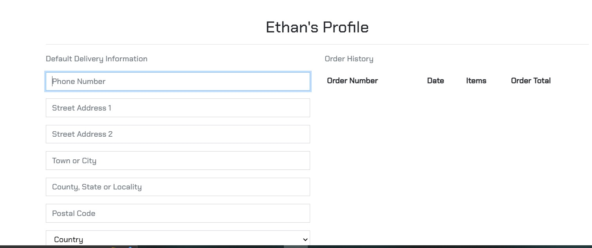
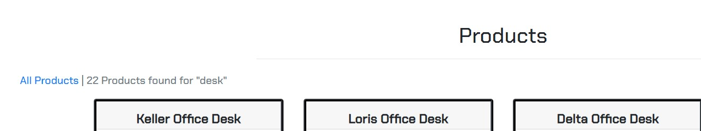
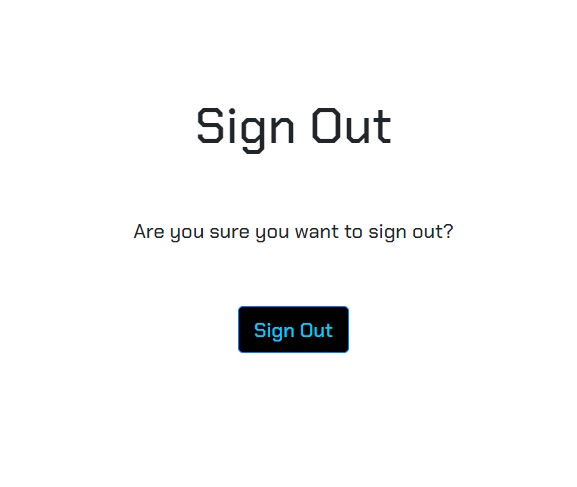

# Coder Space Testing

## Table of contents:
- ##  [Manual testing](#Manual-testing)
     - [Testing User Stories](#Testing-user-stories)

- ##  [Feature Testing](#Feature-testing)
     - [Navbar](#Navbar)
     - [Page Links](#Page-links)
     - [Search box](#Search-box)
     - [Shopping basket](#Shopping-basket)
     - [Header](#Header)
     - [Footer](#Footer)
     - [About page](#About-page)
     - [Contact page](#Contact-page)
     - [Newsletter subscription](#Newsletter-subscription)
     - [Products page](#Products-page)
     - [Products detail page](#Products-detail-page)
     - [Edit and delete](#Edit-and-delete)
     - [Quantity selector box](#Quantity-selector-box)
     - [Review form](#Review-form)
     - [Add product page](#Add-product-page)
     - [My profile page](#My-profile-page)
     - [Register page](#Register-page)
     - [Login page](#Login-page)
     - [Logout page](#Logout-page)
     - [Basket page](#Basket-page)
     - [Checkout buttons](#Checkout-buttons)
     - [Custom error handling pages](#Custom-error-handling-pages)

## Manual Testing
The project was thoroughly tested by the developer and multiple user from friends and family members. Thorough testing was conducted by the developer and multiple users among friends and family especially with order creation, updating totals, editing line items. Bugs were found and fixed as detailed below in [Bugs](#bugs-and-fixes) section. Testing steps and results are detailed as follows.

### Testing User Stories

For User Story testing first navigate to the [Coder Space website](https://coder-space.herokuapp.com/)

* **As a shopper I want to be able to view a list of products so that I can select some to purchase [#1](https://github.com/Charte-dot/Coder-Space/issues/1)**

**Acceptance Criteria**: User registered and unregistered can view a list of products with images and descriptions that are available to purchase.

**Testing Steps**:
1. Without logging in to the site click on the Shop now button or click all products tab on the navigation bar.
2. View list of products
3. Click on individual products to view product page.
4. Individual products page displays all information about that product.

**Expected Result**:
- Shop page opens
- Products display
- Image and summary detail are visible
- Link works as expected

**Actual Result**:
- Shop page with list of individual products is displayed
- Image and summary detail are visible
- Link works as expected

**Pass/Fail: Pass** ✅

---

* **As a Shopper I can View individual products, So I can See the price and product description [#2](https://github.com/Charte-dot/Coder-Space/issues/2)**

**Acceptance Criteria**: User can click on individual product image and open a full detailed page about the product

**Testing Steps**:
1. Without logging in from the Shop page (see User Story test #1), click on a product image
2. Click on individual product image

**Expected Result**:
- Product detail card opens when product image is clicked
- Full product detail card is displayed
- All links in card work correctly

**Actual Result**:
- Product detail card opens when product image is clicked
- Full product detail card is displayed
- All links in card work correctly

**Pass/Fail: Pass**✅

---

* **As a Shopper I can easily identify each category or product available, So I can find the exact product I need [#3](https://github.com/Charte-dot/Coder-Space/issues/3)**

**Acceptance Criteria**: Well sign posted labels within the site directing users to different categories and products available.

**Testing Steps**:
1. Click on the all products link to view all products
2. Click on the labelled nav bar to narrow down the products search
3. Choose a category from each main nav tab to view certain products. ie computers nav tab - computer related products

**Expected Result**:
- Each nav tab displays sub nav category
- Each category displays a nav link to specific product category ie computer nav tab for computer related products
- All links in nav work correctly

**Actual Result**:
- Each nav tab displays sub nav category
- Each category displays a nav link to specific product category ie computer nav tab for computer related products
- All links in nav work correctly

**Pass/Fail: Pass**✅

---

* **As a Shopper I can Easily identify the total cost of my purchases at all times, So I can Keep track of total cost. [#4](https://github.com/Charte-dot/Coder-Space/issues/4)**

**Acceptance Criteria**: User's total cost displays beneath the bag icon and updates and the user places items into the bag

**Testing Steps**:
1. Without logging in check basket icon and amount are visible in navbar (0euro if basket is empty)
2. Navigate to Shop page
3. Click on product image to open product detail
4. Click on add to basket
5. Check amount beside icon in navbar
6. Click on basket icon

**Expected Result**:
- Basket icon is visible in navbar - set to 0 when basket is empty
- Total amount updates as basket changes
- When clicked basket icon opens Shopping Basket page

**Actual Result**:
- Basket icon is visible in navbar with amount corresponding to basket total visible
- When clicked basket icon opens Shopping Basket page

**Pass/Fail: Pass**✅

---

* **As a shopper I want to be able to view more information about the store so that I can increase my confidence that the store is genuine, trustworthy and reliable to purchase from [#5](https://github.com/Charte-dot/Coder-Space/issues/5)**

**Acceptance Criteria**: About page visible and linked in navigation

**Testing Steps**:
- In quick links located with in the footer click about us page.

**Expected Result**:
- About Page opens

**Actual Result**:
- About Page opens when About link is clicked

**Pass/Fail: Pass**✅

---

* **As a Shopper I can View a review on products, So I can decide if a product will suit my needs. [#6](https://github.com/Charte-dot/Coder-Space/issues/6)**

**Acceptance Criteria**:  A review form for registered users to leave a review on products they have bought.

**Testing Steps**:
1. Navigate to products page
2. Click on product image to open product detail
3. Previous reviews are viewable under product details

**Expected Result**:
- Reviews for each product are viewable on each product page
- If user is logged in option to leave a review if unregistered or not logged in prompt to log in to leave a review

**Actual Result**:
- Reviews for each product are viewable on each product page
- If user is logged in option to leave a review if unregistered or not logged in prompt to log in to leave a review

**Pass/Fail: Pass**✅

---

* **As a Shopper I can View a social media page for more info on products, So I can view any offers or extra content from the store [#7](https://github.com/Charte-dot/Coder-Space/issues/7)**

**Acceptance Criteria**: Add a social media page for the site

**Testing Steps**:
1. From any page navigate to the footer section
2. In turn click on Facebook, Twitter and Instagram icons

**Expected Result**:
1. When clicked Facebook icon opens Facebook in a new tab (Image is a mockup Facebook business page)
2. When clicked Twitter and Instagram main page sites open in a new tab

**Actual Result**:
- When icons are clicked Facebook, Twitter and Instagram main pages open in new tabs

**Pass/Fail: Pass**✅

---

* **As a Shopper I can register for an account, So I can have a personal account to be able to save details and view previous orders [#11](https://github.com/Charte-dot/Coder-Space/issues/11)**

**Acceptance Criteria**: User can register for an account with an email and password.

**Testing Steps**:
1. Make sure to be not logged in to the website and click on my account in the navbar
2. Click on the Register link in the dropdown menu
3. In the register form click on the back to sign in link to check link
4. Repeat steps 1 and 2
5. Click on the sign up button without entering anything in the first field
6. Complete the first field and repeat step 5 for the other fields
7. With all fields complete click sign up

**Expected Result**:
**Actual Result**:
1. Back to login and sign up links link correctly to sign in page
2. Success message asking user to confirm their email address appears when user has registered
3. Email is sent to user's email address with link to confirm email address
4. Link to confirm email address functions correctly
5. Error message displays if error occurs when fillling out registration form

**Actual Result**:
1. Back to login and sign up links link correctly to sign in page
2. Success message asking user to confirm their email address appears when user has registered
3. Email is sent to user's email address with link to confirm email address
4. Link to confirm email address functions correctly
5. Error message displays if error occurs when fillling out registration form

**Pass/Fail: Pass**✅

---

* **As a Registered shopper I can Easily login and logout of my account, So I can access my own account on the site [#12](https://github.com/Charte-dot/Coder-Space/issues/12)**

**Acceptance Criteria**: User can login to account with password and email used to set up account on registration page.

**Testing Steps**:
1. When not logged in click my account in navigation menu
2. Click on login link
3. Complete username and password boxes
4. Click sign in button

**Expected Result**:
- User is signed in when information fields are completed
- User's information is automatically completed if they have checked the remember me box

**Actual Result**:
- User is signed in
- User's information is automatically completed if they have checked the remember me box
- During testing it was apparent that it would be useful to easily see which user was logged in so the username was added to the title in the My Profile page

**Pass/Fail: Pass**✅

---

* **As a Registered shopper I can recover my password hassle free should I forget it, so I can gain access to my account. [#13](https://github.com/Charte-dot/Coder-Space/issues/13)**

**Acceptance Criteria**: User can recover/change password from user profile

**Testing Steps**:
1. Click on profile icon in navigation menu
2. Click on login link
3. Click on forgot password link
4. Enter email address
5. Open email and click on link to reset password

**Expected Result**:
- Password is successfully changed and success message appears
- User is able to log in with new password

**Actual Result**:
- Password is successfully changed and success message appears
- User is able to log in with new password

**Pass/Fail: Pass**✅

---

* **As a registered shopper I can Have a confirmation email to advise that registration has bee successful, So I can Have acknowledgement that my registration details were accepted and saved. [#14](https://github.com/Charte-dot/Coder-Space/issues/14)**

**Acceptance Criteria**
1: User clicks on my account nav tab in navigation to open profile
2: User can view delivery details and order history in my profile

**Testing Steps**:
1. When not logged in click on profile icon in navigation menu
2. Type https://coder-space.herokuapp.com/profile/ into the address bar
2. Log in and repeat step 1
2. Click on My Profile

**Expected Result**:
- User can view order history and delivery information for their own account when they click on My Profile
- If not logged in My Profile link is not visible
- When not logged in if user navigates to https://coder-space.herokuapp.com/profile/ they are redirected to the Sign In page

**Actual Result**:
- User can view order history and delivery information for their own account when they click on My Profile
- If not logged in My Profile link is not visible
- When not logged in if user navigates to https://cpder-space.herokuapp.com/profile/ they are redirected to the Sign In page

**Pass/Fail: Pass**✅

---

* **As a Registered shopper I can have a personal profile, So I can View my personal details for delivery and payment and update as needed [#15](https://github.com/Charte-dot/Coder-Space/issues/15)**

**Acceptance Criteria**
- Email is sent to user account with confirmation link
- Confirmation link links to website confirmation page
- User is able to login with login credentials

**Testing Steps**:
1. Make sure to be not logged in to the website and click on the profile icon in the navbar
2. Click on the Register link in the dropdown menu
3. Complete the form fields as in User Story #9
4. Navigate to user's email account
5. Click on link in email to confirm email
6. Click on confirm button on website
7. Login with registration details

**Expected Result**:
1. Email is sent to user account with link to confirm address
2. When email link is clicked user is directed to website link to click to confirm email address.
3. Registration is confirmed with message.
4. User logs in with provided login information

**Actual Result**:
1. Email is sent to user account with link to confirm address
2. When email link is clicked user is directed to website link to click to confirm email address.
3. Registration is confirmed with message.
4. User logs in with provided login information

**Pass/Fail: Pass**✅

---

* **As a shopper I want to be able to easily see what I have searched for and the number of results so that I can quickly see how many products are available[#17](https://github.com/Charte-dot/Coder-Space/issues/17)**

**Acceptance Criteria**
- Search page displays search item and number of results found above the display of search items

**Testing Steps**:
1. Type single word into search box in navbar
2. Click search icon or enter
3. Repeat and enter empty search

**Expected Result**:
1. Above products found list the search term and number of results is printed
2. If no results are found this is stated

**Actual Result**:
1. Above products found list the search term and number of results is printed
2. If no results are found this is stated

**Pass/Fail: Pass**✅

---

* **As a Shopper I can select the quantity of a product that I am purchasing, So I can visually see the correct quantity and modify if needed. [#18](https://github.com/Charte-dot/Coder-Space/issues/18)**

**Acceptance Criteria**
- User can select quantity of product to add to bag when looking at the product detail page

**Testing Steps**:
1. Click on products link in navbar
2. Click on item to test
3. Click on quantity selector box + and - in turn
4. Click on add to basket
5. Enter a value into the box, including decimal numbers and negative numbers
6. Click on add to basket button

**Expected Result**:
- Product quantity is updated in basket as selected
- Error message appears when decimal or negative is entered

**Actual Result**:
- Product quantity is updated as selected when integer
- Validation errors show when decimal or negative number is entered into the box

**Pass/Fail: Pass**✅

---

* **As a Shopper I can View items as they are placed in my basket, So I can keep account of the total cost of the purchase [#19](https://github.com/Charte-dot/Coder-Space/issues/19)**

**Acceptance Criteria**
-  User can click on basket icon in navbar from any page to see contents

**Testing Steps**
1. Follow steps in User Story #19 to add item(s) to basket
2. View basket icon in navbar
3. Click on basket icon in navbar

**Expected Result**:
1. Total cost of items in basket is viewable in navbar
2. Basket icon opens when clicked to full basket page

**Actual Result**:
1. Total cost of items in basket is viewable in navbar
2. Basket icon opens when clicked to full basket page

**Pass/Fail: Pass**✅

---

* **As a Shopper I can enter my payment details hassle free, So I can checkout my purchases quickly and easily [#21](https://github.com/Charte-dot/Coder-Space/issues/21)**

**Acceptance Criteria**

1: User clicks on checkout to complete payment form
2: Success message visible on completion of payment process

**Testing Steps**:
1. With items in basket and in basket page (follow previous steps) click Checkout button
2. Attempt to checkout without completing form fields correctly
3. Complete fields correctly
4. Complete card payment field with fake card details
5. Complete card payment with card number 4242 4242 4242 4242 

**Expected Result**:
1. Error message shows when fields are incorrectly completed
2. Error message shows when card number does not use test card number
3. Success message and order confirmation message displayed to user when order is completed
4. Payment success shown in Stripe dashboard
5. Stripe webhooks shows charge success

**Actual Result**:
1. Error message shows when fields are incorrectly completed
2. Error message shows when card number does not use test card number
3. Success message and order confirmation message displayed to user when order is completed
4. Payment success shown in Stripe dashboard
5. Stripe webhooks shows charge success

**Pass/Fail: Pass**✅

---

* **As a Shopper I can Give my personal payment details and information and know its secure and safe , So I can Be confident to be able to provide the necessary information to make a purchase [#22](https://github.com/Charte-dot/Coder-Space/issues/22)**

**Acceptance Criteria**
1. User receives success/error messages when completing order/payment
2. User can view order history in personalised profile when logged in
3. Padlock appears in site address bar indicating secure payment process and padlock in checkout button

**Testing Steps**:
1. Complete steps to make test purchase as outlined above
6. Click on profile icon in navbar
7. Click on My Profile link

**Expected Result**:
1. Padlock symbol appears in address bar during checkout process and padlock is on checkout button
2. Success message and order confirmation message displayed to user when order is completed
3. Order appears in user's secure profile page

**Actual Result**:
1. Padlock symbol appears in address bar during checkout process and padlock is on checkout button
2. Success message and order confirmation message displayed to user when order is completed
3. Order appears in user's secure profile page

**Pass/Fail: Pass**✅

---

* **As a Shopper recieve an order confirmation after order has been placed, To have an written record of my purchases [#23](https://github.com/Charte-dot/Coder-Space/issues/23)**

**Acceptance Criteria**
1. User receives order confirmation in terminal with name, order information.

**Testing Steps**:
- Complete test purchase steps as outlined above

**Expected Result**:
- Order confirmation message is visible with all order details on screen on completion of purchase

**Actual Result**:

- Order confirmation message is visible with all order details on screen on completion of purchase

**Pass/Fail: Pass**✅

---

* **As a Site owner I can add products to my site , So I can add new items to the site when needed [#24](https://github.com/Charte-dot/Coder-Space/issues/24)**

**Acceptance Criteria**
1. Admin can click on Add a product link in nav bar to display add product form
2. Admin can add a product, save by clicking add product button and view on site

**Testing Steps**:
When logged in as Administrator
1. Click on my account in navbar
2. Click on product management
3. Complete product information fields incorrectly
4. Complete product information fields correctly
5. Click Cancel button
6. Repeat steps 1-4 and click Add Product
7. Navigate to Shop page by clicking on all products

**Expected Result**:
1. Invalid entries/missing fields are highlighted
2. Cancel button returns user to Shop page
3. Add Product button adds a Product to the Shop page
4. Success message displays
5. If no image added, placeholder image displays

**Actual Result**:
1. Invalid entries/missing fields are highlighted
2. Cancel button returns user to Shop page
3. Add Product button adds a Product to the Shop page
4. Success message displays
5. If no image added, placeholder image displays

**Pass/Fail: Pass**✅

---

* **As a site owner I can edit and update a product so that I can change information on a product as needed. [#25](https://github.com/Charte-dot/Coder-Space/issues/25)**

**Acceptance Criteria**
1. Admin can click on an edit button in product details page to open up edit form
2. Admin can edit and then click update button to update and save changes to products

**Testing Steps**:
1. When not logged in as admin/superuser click on All Products link in Shop dropdown navbar menu
2. View a product to check edit/remove buttons not visible
3. Log in as admin
4. Click on Edit button on product
5. In Edit Product form edit fields as required
6. Click on Update Product button
7. Check product details have changed by clicking to open product detail view from All Products page
9. Log out
10. Repeat steps 1-8 for product detail page by clicking on a product in the Shop to open up the detail page
11. Repeat steps 1-4 and click cancel

**Expected Result**:
- Edit/Remove buttons are not visible to non-admin users
- Product fields are updated when edit form is completed and Update PRoduct button is clicked
- Success message is displayed when product is updated
- When cancel button is clicked user is returned to Shop page

**Actual Result**:
- Edit/Remove buttons are not visible to non-admin users
- Product fields are updated when edit form is completed and Update PRoduct button is clicked
- Success message is displayed when product is updated
- When cancel button is clicked user is returned to Shop page

**Pass/Fail: Pass**✅

---

* **As a site owner I can delete products so that I can remove Items no longer for sale. [#26](https://github.com/Charte-dot/Coder-Space/issues/26)**

**Acceptance Criteria**
1. Admin can click on delete button on product detail page to delete a product

**Testing Steps**
1. Click on All Products link in Shop dropdown navbar menu
2. Click on delete button on product in All Products Page
3. Check product is deleted in All Products page
4. Click on All Products link in Shop dropdown navbar menu
5. Click on Product to open up full product detail page
6. Click on delete button
7. Open up product detail page by clicking on product in All Products page 
8. Repeat step 2 - 5
9. Check product is deleted in All Products page

**Expected Result**:
1. Product has been deleted
2. Success message is displayed

**Actual Result**:
1. Product has been deleted
2. Success message is displayed

**Pass/Fail: Pass**✅

---

* **As a Shopper I can review Products, So I can give a good view to other shoppers of the product. [#28](https://github.com/Charte-dot/Coder-Space/issues/28)**

**Acceptance Criteria**
1. Comment option on all posts
2. Comments appear in descending order like a conversation

**Testing Steps**
1. Click on All Products link in Shop dropdown navbar menu
2. Click on a product you want to review.
3. If user is logged in a "leave a review button" is displayed
4. If user is unregistered or not logged in a "log in to review" button is displayed
5. To leave a review press review button.
6. Fill in review form.
7. Review appears on products
8. Admin can delete review form admin panel.

**Expected Result**:
1. Review has been posted
2. Success message is displayed

**Actual Result**:
1. Review has been posted
2. Success message is displayed

**Pass/Fail: Pass**✅

---
* **As a Shopper I can contact the store with any product or purchase queries, So I can resolve any product or purchase issues I may have [#29](https://github.com/Charte-dot/Coder-Space/issues/29)**

**Acceptance Criteria**
1. User can click on the contact us in quick links to send a message to coder space
2. Success message displays

**Testing Steps**:
1. Click on contact us in quick links in footer
2. Complete form fields first attempting to submit empty fields
3. Click on Send

**Expected Result**:
1. Links to form in footer open up contact form
2. When fields are incorrectly completed error messages display
3. Message sent success message displays when message is sent
4. Success message displays when form is submitted
5. Contact Message appears in admin panel

**Actual Result**:
1. Links to form in footer open up contact form
2. When fields are incorrectly completed error messages display
3. Message sent success message displays when message is sent
4. Success message displays when form is submitted
5. Contact Message appears in admin panel

**Pass/Fail: Pass**✅

---
* **As a Shopper I want to be able to sign up to a newsletter, So I can keep up to date with new products that become available [#30](https://github.com/Charte-dot/Coder-Space/issues/30)**

**Acceptance Criteria**
1. User can sign up with email to a newsletter subscription service on the site.

**Testing Steps**
1. Click on subscribe button in footer
2. Complete the email section
3. Click on Send

**Expected Result**:
1. Link to subscribe form opens
2. When fields are incorrectly completed error messages display
3. Message sent success message displays when message is sent
4. User recieves an email notifying of subscription to Coder Space newletter.
5. If user unsubscribes to newsletter, confirmation email is also sent.

**Expected Result**:
1. Link to subscribe form opens
2. When fields are incorrectly completed error messages display
3. Message sent success message displays when message is sent
4. User recieves an email notifying of subscription to Coder Space newletter.
5. If user unsubscribes to newsletter, confirmation email is also sent.

**Pass/Fail: Pass**✅

---

## Features Testing

## Navbar ##

**Logo**

**Expected Result**: 
- Links to home page

**Testing Steps**:
- Click on logo in navbar menu

**Actual Result**:
- Links to home page

**Pass/Fail: Pass**✅

---
## Page Links ##

**Expected Result**:
- All links to pages link to the corresponding pages
- When the navigation page menu links are hovered over the font color changes to white

**Testing Steps**:
1. Navigate to navbar menu
2. Click on each page link in turn: All products, furniture, computers, sound, room decor and my account.
3. Repeat for collapsed menu

**Actual Result**:
- All page links work as expected
- Links change colour on hover
-
**Pass/Fail: Pass**✅

---

## Search Box ## 
On large screens a search box appears in the center of the nav bar. Users can enter a single word to search within the title or description of a product. Users can click enter or the magnifying glass icon to enter the search. The products list is then filtered by the search term and resulting products are displayed with the number of results displayed above. If no products are found '0 products found' is displayed. On smaller screens the search box is hidden behind a search icon and when clicked the search box drops down/.

**Expected Result**:
1. User can enter a search word into the search box
2. Above products found list the search term and number of results is printed
3. If no results are found this is stated
4. If empty search is entered error message is displayed

**Testing Steps**:
1. Type single word into search box in navbar
2. Click search icon or enter
3. Repeat and enter empty search

**Actual Result**:
1. Search term and number of results are printed including if none found
2. Error message displays if search is empty

**Pass/Fail: Pass**✅

---

## Shopping Basket ##
 Icon with total cost indicator: On large screens the shopping basket appears on the right of the menu. When clicked the icon opens up the current basket page. Beside the basket is an indicator of the total cost of the items currently in the basket, also coloured red to match the basket. 

**Expected Result**:
1. When clicked the icon opens up the full current basket page. 
2. The indicator to the right of the basket icon indicates the total cost of the items currently in the basket
3. The indicator updates as items are added to tbe basket

**Testing Steps**:
1. Click on a product in All Products
2. Click on Add to Basket
2. Check that basket total updates in basket icon

**Actual Result**:
1. Total amount in basket is updated when product is added and total displays in navbar

**Pass/Fail: Pass**✅

---

## Header ##
The navbar sticks to the top of the screen as the user scolls on larger screens but not on smaller screens where space is limited

**Expected Result**:
- Navigation menu remains displayed when scrolling for large screens but scrolls with smaller screens

**Testing Steps**:
1. On desktop view Home Page or any page start to scroll from top of screen
2. Repeat for mobile view

**Actual Result**:
- Navigation menu remains displayed when scrolling for large screens but scrolls with smaller screens

**Pass/Fail: Pass**✅

---

## Footer ##
- The footer is divided into three sections: Quick links to home, about, contact and privacy pages. The center column is a subscribe to the newsletter with button that leads user to a separate page to subscribe. The Facebook,Twitter and Instagram social media links do not currently link directly to business pages as the business is not currently live. 

**Testing Steps**:
Click on each link in footer in turn and check correct page opens

**Expected Result**:
1. All links open up correct corresponding pages
2. The social media icons link to Facebook, Twitter and Instagram main pages. 
3. When the user clicks on the Contact page link the Contact page form opens.
4. The Subscribe button takes the user to a subscribe page with an unsubscribe option.

**Expected Result**:
1. All links open up correct corresponding pages
2. The social media icons link to Facebook, Twitter and Instagram main pages. 
3. When the user clicks on the Contact page link the Contact page form opens.
4. The Subscribe button takes the user to a subscribe page with an unsubscribe option.

**Pass/Fail: Pass**✅

---

## About Page ##
- Features information about the store. 

**Testing Steps**:
1. Navigate to About Page by clicking on link in footer menu

**Expected Result**:
- About link opens about page

**Actual Result**:
- About link opens about page

**Pass/Fail: Pass**✅

---

## Contact Page ##
- A form for user to contact store with any queries. 

**Testing Steps**:
1. Navigate to contact Page by clicking on link in footer menu
2. Fill in contact us form.
4. Press Send.

**Expected Result**:
- contact link opens about page
- Users are notified of any form errors.
- When submitted a notification alerts the user that the form has been sent.

**Actual Result**:
- contact link opens about page
- Users are notified of any form errors.
- When submitted a notification alerts the user that the form has been sent.

**Pass/Fail: Pass**✅

---

## Newsletter subscription ##
- A form for user to subscribe to an online newsletter

**Testing Steps**:
1. Navigate to Subscribe Page by clicking on subscribe button in footer menu
2. Fill in email field on the form.
4. Press Send.

**Expected Result**:
- Subscribe button opens about page
- Users are notified of any email errors.
- When submitted a notification alerts the user that the form has been sent.
- User recieves an email notifying of the subscription.

**Actual Result**:
- Subscribe button opens about page
- Users are notified of any email errors.
- When submitted a notification alerts the user that the form has been sent.
- User recieves an email notifying of the subscription.

**Pass/Fail: Pass**✅

---

## Products page ##

- Products page displays all products available in store

**Testing Steps**:
1. Navigate to products page by clicking on the shop now button on the home page or on All Products in Shop navbar dropdown menu 
2. Check view on large, medium and small sized screens
3. Click on product images to open product detail
4. If logged as Administrator check that edit/delete buttons are visible
5. If not logged as Administrator check that edit/delete buttons are not visible
6. Login/Logout as Administrator to check the visibility of edit/delete buttons

**Expected Results**:
1. When all products is selected in the navigation menu the products are listed in rows of four on extra-large screens, three on large screens, two on medium and one on small screens
2. Above the products list on the left on medium screens and up and is text specifying the number of products. 
3. Each product image in the product list links to its product detail page
6. Edit/delete buttons are visible only to superuser/administrator under the product price

**Actual Result**:
1. When all products is selected in the navigation menu the products are listed in rows of four on extra-large screens, three on large screens, two on medium and one on small screens
2. Above the products list on the left on medium screens and up and is text specifying the number of products. 
3. Each product image in the product list links to its product detail page
6. Edit/delete buttons are visible only to superuser/administrator under the product price

**Pass/Fail: Pass**✅

---
## Product Detail Page ##

**Product Details**- This page features a large image of the product and product detail information specific to each product 

**Testing Steps**:
1. Navigate to the Product detail page by clicking on an item in the products page

**Expected Result**:
1. Each product detail page features a large image of the product
2. Product details can be seen on the page as appropriate - name, price, description. 

**Actual Results**:
1. Each product detail page features a large image of the product
2. Product details can be seen on the page as appropriate - name, price, description. 

**Pass/Fail: Pass**✅

---
## Edit and delete ##

**Testing Steps**:
1. Navigate to product detail page when not logged in as administrator
2. Repeat step 1 after logging in as administrator
For these steps please create a test product by clicking on the my account in the navbar and then clicking Add a Product and completing the fields
3. Open the test product created in product detail view
4. Click on Edit button
5. Leave fields empty and click Update Product
5. Complete product information fields correctly
6. Click Cancel button
7. Repeat steps 1-4 and click Update Product
8. Navigate to products page by clicking on all products link
9. Locate test product and click Delete

**Expected Result**:
1. Edit/delete buttons are visible to superuser/administrator under the product name
2. Edit/delete buttons are not visible to user who is not a superuser/administrator
3. Edit button when clicked opens Update product form
4. User is able to complete and submit form when required fields are filled
5. Empty required fields yield error message and form cannot be submitted
6. Update Product button function updates product information
7. Delete button when clicked deletes product
8. Success message displays after update or delete function is completed

**Actual Result**:
1. Edit/delete buttons are visible to superuser/administrator under the product name
2. Edit/delete buttons are not visible to user who is not a superuser/administrator
3. Edit button when clicked opens Update product form
4. User is able to complete and submit form when required fields are filled
5. Empty required fields yield error message and form cannot be submitted
6. Update Product button function updates product information
7. Delete button when clicked deletes product
8. Success message displays after update or delete function is completed

**Pass/Fail: Pass**✅

---
## Quantity selector box ##

**Testing Steps**:
1. Click on all products link in navbar
2. Click on item to test
3. Click on quantity selector box + and - in turn
4. Click on add to basket
5. Click on basket icon

**Expected Result**:
1. The + and - selector buttons increase/decrease quantity number inside the box. 
2. Users can also enter number or use arrows inside box to increase/decrease quantity of item

**Actual Result**:
1. The + and - selector buttons increase/decrease quantity number inside the box. 
2. Users can also enter number or use arrows inside box to increase/decrease quantity of item

---
## Review form ##

**Testing Steps**:
1. Click on all products link in navbar
2. Click on item to review.
3. If user is logged in a "leave a review" button is shown.
4. If user is not logged in a "Log in to leave a review" prompt is displayed.
5. Click on leave a review button.
6. Fill in the review form.
7. Press send review.
8. Review appears on the product.
9. Admin can delete review if unsuitable for the admin panel.

**Expected Result**:
1. User selects leave and review and fills in form
2. An alert lets the user know that they have posted a review.
3. Review is displayed under the product user is reviewing.

**Actual Result**:
1. User selects leave and review and fills in form
2. An alert lets the user know that they have posted a review.
3. Review is displayed under the product user is reviewing.

---

## Add a Product Page ##

- This page can only be accessed by the administrator/superuser and is only visible in the navbar menu if the user is logged in as administrator or superuser.
- This page features a form for the administrator/superuser to add a product with fields from the product model: category options, product detail, price, rate and picture of product.
- The form to edit a product accessed by the admistrator from the products or product detail page is the same form as for add a product with the fields auto completed which can be changed by the administrator.

**Testing Steps**:
When logged in as Administrator
1. Click on My account in navbar
2. Click on product management
3. Complete product information fields incorrectly
4. Click Cancel button
5. Repeat steps 1-4 and click Add Product
7. Navigate to Shop page by clicking on all products link

**Expected Result**:
1. Invalid entries/missing fields are highlighted
2. Cancel button returns user to Shop page
3. Add Product button adds a Product to the Shop page
4. Success message displays
5. If no image added, placeholder image displays

**Actual Result**:
1. Invalid entries/missing fields are highlighted
2. Cancel button returns user to Shop page
3. Add Product button adds a Product to the Shop page
4. Success message displays
5. If no image added, placeholder image displays

**Pass/Fail: Pass**✅

---

## My Profile Page ##

- The link to this page can only be seen if a user is logged in
- On the left the default delivery information is displayed if the user has selected save my information during the chackout process.
- The user can change the default information by entering information into the fields
- An update button is below the delivery information form which can be clicked to submit and save changed information
- This page can only be accessed by the user who is signed in
- On the right the user's order history is displayed in a table with order number, date of order, items ordered and the order total. The Order number is truncated but on hover the full number can be viewed. On click the full past order confirmation is displayed

**Testing Steps**:
1. When not logged in click on My account in navbar
2. Repeat step 1 after logging in
3. Click My Profile in Profile dropdown menu
3. Complete or change delivery information
4. Click update
5. Log out
6. Repeat steps 2-3
7. Hover over order number
8. Click on order number

**Expected Result**:
1. Link is only visible if user is logged in and can only be accessed by this user
2. User's saved delivery information is visible
3. Default delivery information can be changed and saved
4. The update button functions to save and update infomation
5. User's order history is displayed
6. When the order number is hovered over the full number is visible
7. When the order number is clicked the past order confirmation is opened

**Actual Result**:
1. Link is only visible if user is logged in and can only be accessed by this user
2. User's saved delivery information is visible
3. Default delivery information can be changed and saved
4. The update button functions to save and update infomation
5. User's order history is displayed
6. When the order number is hovered over the full number is visible
7. When the order number is clicked the past order confirmation is opened

**Pass/Fail: Pass**✅

---

## Register Page ##

- Features a form with input boxes for email and email confirmation, username, password and password confirmation
- Two buttons, signup and back to login page

**Acceptance Criteria**: User can register for an account with email and password

**Testing Steps**:

1. Make sure to be not logged in to the website and click on the my account in the navbar
2. Click on the Register link in the dropdown menu
3. In the form click on the back to login button
4. Repeat steps 1 and 2
5. Repeat steps 1 and 2 and click on sign in link
6. Reapeat steps 1 and 2
7. Click on the sign up button without entering anything in the first field
8. Complete the first field and repeat step 7 for the other fields

**Expected Result**:

1. Back to Login button links to sign in page
2. When information is incomplete or incorrect error message is displayed
3. When registration is complete success message appears asking the user to confirm their email address

**Actual Result**:

1. Back to login and sign up links link correctly to sign in page
2. Error message displays when no or invalid text is entered
3. Success message asking user to confirm their email address appears when user has registered

**Pass/Fail: Pass**✅

---

## Login Page ##

- Features a form with input boxes for required fields username and password
- Two buttons are featured at the bottom of the form for home and sign in

**Acceptance Criteria**

- When user clicks on login/logout they can access My Account page

**Testing Steps**:

1. When not logged in click on my account in navigation menu
2. Click on login link
3. Complete username and password boxes
4. Click sign in button

**Expected Result**:

- User is signed in
- User's information is automatically completed if they have checked the remember me box

**Actual Result**:
- User is signed in
- User's information is automatically completed if they have checked the remember me box

**Pass/Fail: Pass**✅

---

## Logout Page ##

**Acceptance Criteria**

- When user clicks on logout they can access My Account logout page
- User can sign out from the sign out form

**Testing Steps**:

1. When logged in click on my account in navigation menu
2. Click on logout link
3. Click Sign Out button

**Expected Result**:

1. Logout link in profile menu links to SIgn Out form
2. User is signed out

**Actual Result**:

1. Logout link in profile menu links to SIgn Out form
2. User is signed out

**Pass/Fail: Pass**✅

---

## Basket Page ##

- Features summary information of products added to basket: image of products, title, size, price, delivery cost and total
- A button is available to remove items in one go from the basket
- Two CTA buttons are at the bottom of the form for users to return to the shop or checkout

**Expected Result**:

- Summary information of items in basket clearly displayed and updated: image of products, title, price, delivery cost and total

**Testing Steps**:

1. Click on all products link in navbar then All Products in dropdown
2. Click on item to test purchase
4. Click on add to basket
5. Click on basket icon to open basket and view contents

**Actual Result**:

- Summary information of items in basket clearly displayed and updated: image of products, title, price, delivery cost and total

**Pass/Fail: Pass**✅

---

## Checkout buttons ##

**Testing Steps**:

1. Complete steps above to add product to basket
2. Click the Shop button
3. Return to the Basket page by clicking on the basket icon in the navbar
4. Click on the Checkout button

**Expected Result**:

1. The Shop button returns the user to the Shop page
2. The Checkout button opens the Checkout and payment page

**Actual Result**:

1. The Shop button returns the user to the Shop page
2. The Checkout button opens the Checkout and payment page

### Checkout Page

- The Checkout page features input boxes for the necessary payment information inputs: name, email, phone number, street address, town or city, country, post code, country
- At the bottom is the box for card payment information for Stripe. For testing purposes the number 4242 4242 4242 4242 is used
- Two CTA buttons are at the bottom to return to adjust the basket or complete order buttons to complete the payment process

**Testing Steps**:
1. With items in basket and in basket page (follow previous steps) click Checkout button
2. Attempt to checkout without completing form fields correctly
3. Complete fields correctly
4. Complete card payment field with fake card details
5. Complete card payment with card number 4242 4242 4242 4242 
6. Click Check out our specials link

**Expected Result**:
1. User can complete payment process and submit order
2. User cannot checkout without completing required fields
3. Logged in user's email address is prefilled
4. On completion of payment a success message displays and a summary of the order
5. A link displays at bottom to redirect user to Don't Miss tagged items (Specials) which functions correctly

**Expected Result**:
1. Error message shows when fields are incorrectly completed
2. Error message shows when card number does not use test card number
3. Success message and order confirmation message displayed to user when order is completed
4. Payment success shown in Stripe dashboard
5. Stripe webhooks show payment intent and charge success

---
## Custom Error Handling Pages

* 404 page
**Expected Result**:
- Custom 404 page is displayed

**Testing Steps**:
- A non-existent address was typed into the address bar in this case https://coder-space.herokuapp.com/d

**Actual Result**:
- Custom 404 page is displayed

* 500 page

**Expected Result**:
- Custom 500 page is displayed

**Testing Steps**:
- This page displayed when another error was being tested

**Actual Result**:
- Custom 500 page is displayed

